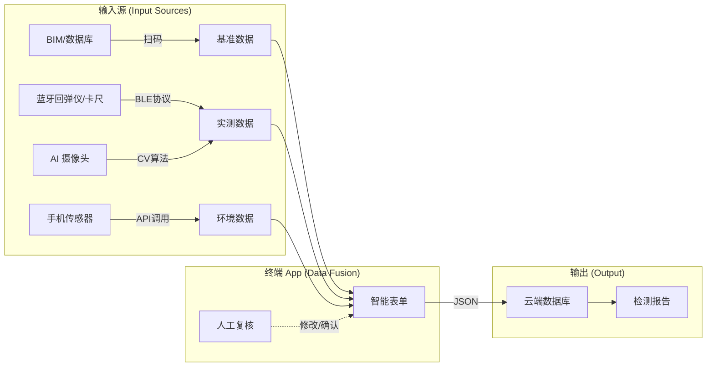

# 工程检测数据采集策略 (Data Acquisition Strategy)

> **核心问题**: "App 里的那些输入框，数据到底从哪里来？"
> **解决方案**: 采用 **"云-端-物"** 三级数据源架构，最大程度减少人工录入，确保数据真实性 (Data Integrity)。

---

## 1. 基准数据 (Context Data) —— "我是谁？"
> **解决痛点**: 工程师到了现场，不知道这根梁的设计强度是多少，也不知道保护层设计厚度是多少。

*   **来源**: **BIM 模型** 或 **数字化台账数据库**。
*   **获取方式**: **扫码 (QR Code / RFID)**。
    *   每一根梁、柱在出厂或验收时都贴有唯一的“身份证”。
*   **数据流**:
    1.  App 扫描构件二维码。
    2.  App 向云端请求该构件的 `MetaData`。
    3.  **自动填充**:
        *   `构件编号`: KL-2-3
        *   `混凝土设计强度`: C30
        *   `保护层设计厚度`: 25mm (此值将直接作为碳化判定的基准)
        *   `环境类别`: 二a类

## 2. 实测数据 (Measurement Data) —— "我的状态？"
> **解决痛点**: 人工读数、手写记录容易出错，甚至存在“填假数”的风险。

### 方式 A: 智能硬件直连 (Smart Tools via BLE) —— **推荐**
目前主流的工程检测工具都已具备蓝牙功能：
*   **数字回弹仪**: 弹击一下，回弹值自动通过蓝牙传输到 App 输入框。
*   **蓝牙游标卡尺/测深尺**: 测量碳化深度后，按一下“发送键”，数据上屏。
*   **激光测距仪**: 测量层高、开间尺寸，数据直连。
*   **优势**: 数据无法篡改，效率极高。

### 方式 B: AI 视觉识别 (Computer Vision)
针对无法使用电子工具的场景（如裂缝形态、指针式仪表）：
*   **裂缝宽度**:
    *   用户动作：在裂缝旁贴一个标准 Tag (参照物)，拍照。
    *   App 动作：本地 CV 算法识别 Tag 尺寸，计算像素当量，自动得出裂缝宽度 `0.32mm` 并填入。
*   **OCR 读数**:
    *   用户动作：对着老式压力表的表盘拍照。
    *   App 动作：OCR 识别指针位置，读取数值。

### 方式 C: 语音录入 (Voice Input)
针对恶劣环境（手脏、戴手套、高空作业）：
*   用户动作：按住耳机说话 “测点1深度 5毫米，测点2深度 6毫米”。
*   App 动作：ASR (语音转文字) -> NLP (意图识别) -> 填入对应格子。

## 3. 环境数据 (Environmental Data) —— "我在哪里？"
> **解决痛点**: 忘记记录天气、检测时间，导致报告不合规。

*   **来源**: 手机内置传感器 + 公共 API。
*   **自动采集**:
    *   **GPS/北斗**: 经纬度、海拔（证明你真的去过现场）。
    *   **时间戳**: 精确到秒（防补录）。
    *   **气象 API**: 自动拉取当地温湿度、风力（影响回弹值修正系数）。
    *   **手机姿态**: 记录拍照时的俯仰角（证明是仰拍梁底还是俯拍楼板）。

---

## 4. 数据源整合架构图

## 5. 总结

App 中的数据只有 **极少部分** 是需要人工“键盘输入”的（通常仅限于备注或特殊情况说明）。

*   **80% 的数据**（构件信息、环境参数、设备读数）应由系统**自动捕获**。
*   这不仅是为了“省事”，更是为了**“保真”** —— 在工程检测行业，数据的真实性比什么都重要。
