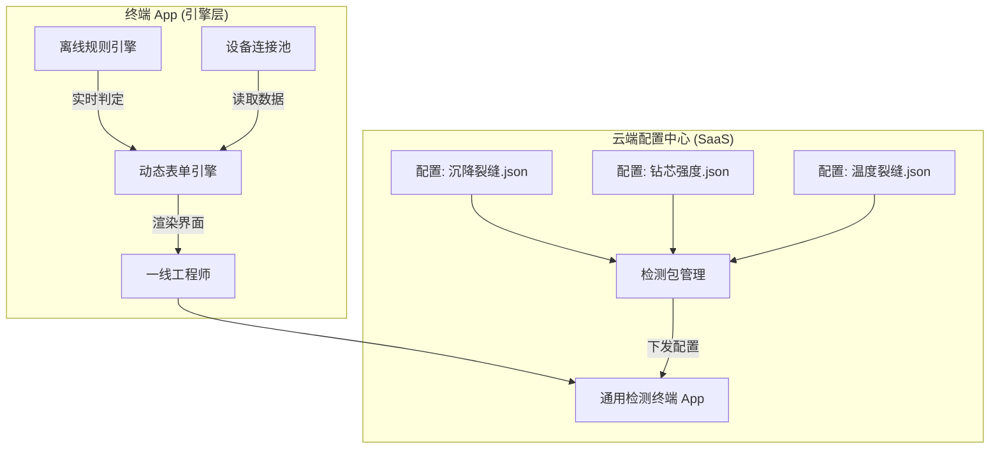

# 通用工程检测与诊断系统架构设计 (Unified Engineering Inspection System Architecture)

> **设计目标**: 解决“每增加一种病害/实验，就需要重新开发一次 APP”的痛点。通过**“平台+内容”**的架构模式，实现新检测项目的零代码/低代码快速上线。

## 1. 核心设计理念 (Core Philosophy)

**不要把“业务逻辑”写死在代码里，而要将其抽象为“配置模型”。**

*   **错误做法**: 为“沉降裂缝”写一套代码，为“钻芯法”写另一套代码。
*   **正确做法**: 开发一套 **“通用检测引擎”**，然后将“沉降裂缝”和“钻芯法”定义为两个不同的 **“检测包 (Inspection Package)”**。

## 2. 抽象模型 (The Meta-Model)

经过分析您提供的三个文档（裂缝测量、钻芯法、沉降裂缝），我们可以提取出所有工程检测任务共有的四个步骤，形成**“检测原子模型”**：

1.  **数据采集 (Input)**: 无论是填数字、拍照、还是连接蓝牙设备，本质都是**表单数据**。
2.  **标准判据 (Rule)**: 无论是 GB 50344 还是 JGJ 125，本质都是**阈值比对**或**决策树**。
3.  **计算逻辑 (Compute)**: 无论是 $W=N \times K$ 还是 $f_{cu} = F/A$，本质都是**数学公式**。
4.  **处置输出 (Output)**: 无论是出具报告还是维修建议，本质都是**模板渲染**。

---

## 3. 系统架构图 (System Architecture)



---

## 4. 核心配置文件设计 (Configuration Design)

如果要上线一个新的检测项目（例如：**钻芯法**），您不需要找程序员写代码，只需要配置如下的 JSON 文件：

### 4.1 数据采集定义 (Schema)
```json
{
  "task_name": "钻芯法检测",
  "version": "1.0",
  "steps": [
    {
      "step_id": "input_basic",
      "title": "试件信息",
      "fields": [
        { "id": "d", "type": "number", "label": "芯样直径 (mm)", "required": true },
        { "id": "H", "type": "number", "label": "芯样高度 (mm)", "required": true },
        { "id": "F", "type": "number", "label": "破坏荷载 (N)", "required": true }
      ]
    }
  ]
}
```

### 4.2 计算与判据逻辑 (Logic)
```json
{
  "computations": [
    {
      "output_var": "ratio",
      "formula": "H / d"  // 自动计算高径比
    },
    {
      "output_var": "strength_raw",
      "formula": "F / (3.14159 * (d/2)^2)" // 自动计算原始强度
    }
  ],
  "rules": [
    {
      "condition": "ratio < 0.95 || ratio > 1.05",
      "action": "warning",
      "message": "高径比超出规范 JGJ/T 384 范围，需查表修正！"
    },
    {
      "condition": "strength_raw < 25.0",
      "action": "alert",
      "message": "强度低于 C25 设计要求，评定为不合格！"
    }
  ]
}
```

### 4.3 报告模板 (Template)
使用占位符自动生成结论：
> "该芯样破坏荷载为 `{F}` N，换算强度为 `{strength_final}` MPa。根据判定，该构件混凝土强度 **{result_status}**。"

---

## 5. 应对“多变性”的策略 (Handling Variability)

针对您提到的“很多种裂缝”，系统通过**组件化**来应对：

| 差异点 | 解决方案 | 举例 |
| :--- | :--- | :--- |
| **输入不同** | **组件库** | 沉降裂缝用“倾斜仪组件”，温度裂缝用“温湿度传感器组件”，钻芯法用“蓝牙压力机组件”。 |
| **流程不同** | **流程编排** | 简单裂缝是“拍->测->判”3步；沉降观测是“周期性任务”（每半月提醒一次）。 |
| **标准不同** | **规则库** | 将 GB 50003、GB 50292 等标准条款数字化为规则库，按需引用。 |

## 6. 总结 (Conclusion)

**不要做“项目外包式”开发，要做“乐高积木式”平台。**

*   **开发人员**：只负责开发“积木块”（如：拍照控件、公式计算器、蓝牙连接器）。
*   **土木专家（您）**：负责用“积木”搭建房子（定义检测流程、录入规范公式）。

这样，当未来有第 4 种、第 5 种新实验时，您只需要在后台配置一下，App 端就能立刻自动更新，无需重新发版。
