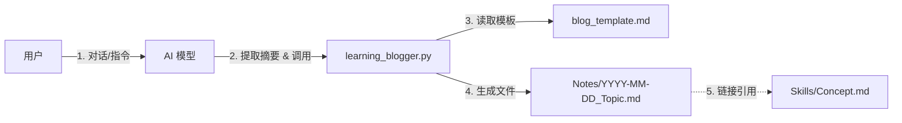

# DESIGN_QuestMap: 学习博客生成器架构设计

> **文档状态**: Draft
> **创建时间**: 2026-01-31
> **所属阶段**: Architect (架构设计)

## 1. 系统架构概览

本系统是一个轻量级的 **AI Skill (工具)**，旨在辅助用户将学习对话转化为结构化的博客文章。

### 1.1 核心组件
1.  **交互层 (Chat Interface)**: 用户与 LLM 的对话界面（如 Windsurf Chat）。
2.  **逻辑层 (Python Skill)**: `tools/learning_blogger.py`
    *   接收对话摘要和元数据。
    *   渲染 Markdown 模板。
    *   处理文件路径和链接。
3.  **数据层 (File System)**:
    *   `Notes/`: 存储生成的博客文章（对话记录）。
    *   `Skills/`: 存储核心知识点文档（被链接的目标）。
    *   `templates/`: 存储博客的 Markdown 模板。

### 1.2 数据流向


---

## 2. 模块详细设计

### 2.1 Python 脚本接口 (`tools/learning_blogger.py`)

我们将实现一个核心类 `LearningBlogger`，包含以下方法：

```python
class LearningBlogger:
    def __init__(self, notes_dir="Notes", skills_dir="Skills"):
        self.notes_dir = notes_dir
        self.skills_dir = skills_dir

    def generate_blog(self, 
                      topic: str, 
                      context: str, 
                      dialogue_summary: list, 
                      core_concepts: list, 
                      tags: list) -> str:
        """
        生成博客文章的主入口。
        :param topic: 文章标题
        :param context: 问题背景
        :param dialogue_summary: 对话列表 [{'role': 'user', 'content': '...'}, ...]
        :param core_concepts: 核心概念列表 ['Python引用', '垃圾回收']
        :param tags: 标签列表
        :return: 生成的文件绝对路径
        """
        pass

    def _ensure_concept_link(self, concept_name: str) -> str:
        """
        检查知识点文件是否存在，如果不存在则标记为待创建。
        返回 Wiki Link 格式：[[Skills/Python/Concept|Concept]]
        """
        pass
```

### 2.2 博客模板 (`templates/blog_template.md`)

```markdown
---
title: {{ topic }}
date: {{ date }}
tags: {{ tags }}
concepts: {{ concepts_links }}
type: conversation-log
status: public
---

# {{ topic }}

## 🎯 核心问题 (The Hook)
> {{ context_summary }}

## 🔍 场景还原 (Context)
{{ context_detail }}

## 💡 探索过程 (The Journey)

### {{ turn.role_display }}
{{ turn.content }}


## 🧠 核心归因 (Root Cause)
这个问题本质上是关于 **{{ main_concept_link }}** 的。
{{ root_cause_analysis }}

## ✅ 行动指南 (Actionable Takeaway)
- [ ] {{ action_item_1 }}
- [ ] {{ action_item_2 }}

## 🔗 延伸思考
- {{ open_question }}
```

---

## 3. 目录结构规范

为了保持项目整洁，我们将建立以下目录结构：

```
YeKai-s-Skill-RoadMap/
├── docs/
│   └── QuestMap/
│       ├── ALIGNMENT_QuestMap.md
│       └── DESIGN_QuestMap.md  <-- 本文件
├── tools/                  <-- 新增：存放所有自定义 Skill 脚本
│   └── learning_blogger.py
├── templates/              <-- 新增：存放生成模板
│   └── blog_template.md
├── Notes/                  <-- 现有：存放生成的博客
└── Skills/                 <-- 现有：存放知识点
```

---

## 4. 用户（你）的任务清单

作为用户，在接下来的 **Automate** 阶段，你需要配合我完成以下工作：

1.  **确认模板**: 审查上面的 `blog_template.md` 内容，看是否符合你的博客审美。
2.  **创建目录**: 我们需要新建 `tools/` and `templates/` 目录。
3.  **运行测试**: 等我写好脚本后，你需要尝试发起一次真实的“学习对话”，并指令我生成博客，看看效果如何。
